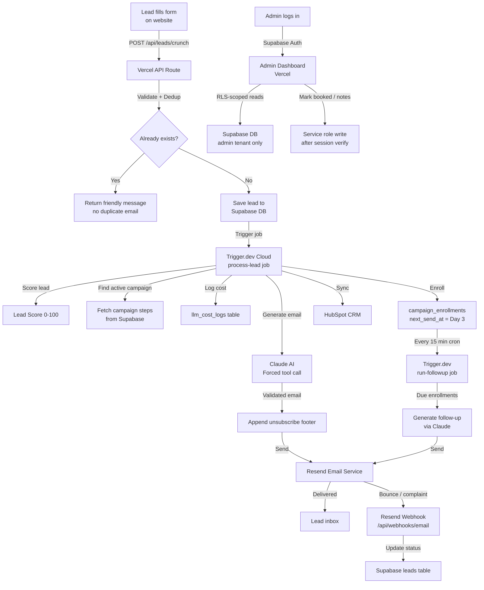

# Project Architecture — Fitness Lead Qualifier

---

## System Overview

The Fitness Lead Qualifier is a cloud-based system that automatically captures gym enquiries, scores them, generates personalised AI emails, and nurtures leads over 14 days — with zero manual work from the gym team.

It is built on four cloud services that work together:

| Service | What it does in this system |
|---|---|
| **Vercel** | Hosts the website and API — runs the Next.js app |
| **Supabase** | The database — stores all leads, emails, and logs |
| **Trigger.dev** | Runs background jobs — email generation happens here |
| **Resend** | Sends the actual emails to leads |
| **Anthropic (Claude)** | AI that writes personalised emails |
| **HubSpot** | CRM — receives a copy of each lead |

---

## High-Level Flow Diagram



---

## Component Breakdown

### 1. Next.js App (Vercel)

The main application. Contains:

- **Public pages:**
  - `/lead/[tenant]` — the enquiry form (public, anyone can access)
  - `/unsubscribe/[token]` — unsubscribe confirmation page

- **Admin pages** (login required):
  - `/admin/sign-in` and `/admin/sign-up` — auth pages
  - `/admin` — dashboard
  - `/admin/leads` — leads list with detail panel

- **API routes:**
  - `POST /api/leads/[tenant]` — receives new lead submissions
  - `GET/PATCH /api/admin/leads` — admin lead management
  - `POST /api/webhooks/email` — Resend bounce/complaint events
  - `POST /api/webhooks/facebook` — Facebook Lead Ads events
  - `GET /api/unsubscribe/[token]` — unsubscribe action

### 2. Supabase (Database + Auth)

Eight tables:

```
tenants              ← gym brands / locations
admin_users          ← maps Supabase auth users to tenants
leads                ← every enquiry form submission
campaigns            ← email sequence config (steps, templates)
campaign_enrollments ← which lead is on which step of which campaign
email_logs           ← every email sent (subject, preview, status)
audit_logs           ← every status change (timestamped trail)
llm_cost_logs        ← every Claude API call (tokens + USD cost)
```

**Row Level Security (RLS):** The database enforces that Admin A can only read their own tenant's leads. Even if someone bypassed the app, the database itself blocks cross-tenant reads. All writes go through the service-role client after the app has verified the session.

### 3. Trigger.dev (Background Jobs)

Two cloud jobs:

**`process-lead`** — Triggered immediately when a new lead is saved:
1. Check idempotency (skip if email already sent)
2. Score the lead
3. Find the active campaign
4. Check daily cost cap ($5 USD per tenant)
5. Generate email via Claude (forced tool call, Zod-validated)
6. Log LLM cost
7. Send email via Resend with unsubscribe footer
8. Enroll lead in campaign (set next_send_at)
9. Update lead status to `email_sent`
10. Sync to HubSpot (non-blocking)

**`run-followup`** — Runs every 15 minutes via cron:
1. Find all active enrollments where `next_send_at <= now()`
2. For each: generate and send the next step email
3. Advance enrollment to next step or mark completed

### 4. Resend (Email Delivery)

- Sends all outbound emails
- Provides webhook notifications for bounce and spam complaints
- Webhook endpoint: `/api/webhooks/email`
- Signature verification via Svix (`RESEND_WEBHOOK_SECRET`)

### 5. Claude AI (Anthropic)

- Used in both `process-lead` and `run-followup`
- **Forced tool call pattern:** Claude must call a `send_email` tool with `{subject, body}` — this prevents free-text responses and makes output Zod-validatable
- Model: `claude-sonnet-4-6`
- Daily cost cap enforced per tenant in `llm_cost_logs`

---

## Security Architecture

### Authentication Layers

```
Browser request to /admin/*
        ↓
[1] middleware.ts — checks Supabase session cookie
        ↓ (no session → redirect to /admin/sign-in)
[2] Layout server component — second session check
        ↓ (no session → redirect)
[3] API route — auth.getUser() → 401 if missing
        ↓ (verified)
[4] Supabase RLS — database enforces tenant scope
        ↓
Data returned
```

### Service-Role Key Rules

The `SUPABASE_SERVICE_ROLE_KEY` bypasses RLS and must NEVER be exposed to the browser. Rules:
- Only used in API routes (`/app/api/**`) — server-side only
- Only used in Trigger.dev jobs (`trigger/`) — server-side only
- Never in any file with `'use client'` at the top
- Verified with: `grep -r SUPABASE_SERVICE_ROLE_KEY frontend/` — must only show server files

### Webhook Security

Both webhooks verify cryptographic signatures before processing any event:
- Facebook: HMAC-SHA256 (`FB_APP_SECRET`)
- Resend: Svix signature (`RESEND_WEBHOOK_SECRET`)
- If secret env var is not set → returns 500 (no silent bypass)

---

## Data Flow — Environment Variables

```
Browser
  └── NEXT_PUBLIC_SUPABASE_URL        (safe to expose)
  └── NEXT_PUBLIC_SUPABASE_ANON_KEY   (safe to expose — RLS protects)

Vercel Server (API Routes)
  └── SUPABASE_SERVICE_ROLE_KEY       (secret — bypasses RLS)
  └── TRIGGER_SECRET_KEY              (tr_prod_... — routes jobs to cloud)
  └── RESEND_WEBHOOK_SECRET           (webhook verification)
  └── FB_APP_SECRET                   (Facebook HMAC)
  └── FB_WEBHOOK_VERIFY_TOKEN         (Facebook challenge)
  └── UPSTASH_REDIS_REST_URL          (rate limiting)
  └── UPSTASH_REDIS_REST_TOKEN        (rate limiting)

Trigger.dev Cloud (Background Jobs)
  └── SUPABASE_SERVICE_ROLE_KEY       (DB writes)
  └── ANTHROPIC_API_KEY               (Claude calls)
  └── RESEND_API_KEY                  (email sending)
  └── APP_URL                         (unsubscribe links — NOT NEXT_PUBLIC_APP_URL)
```

---

## Skills Used During Implementation

| WAT Skill | Where Applied |
|---|---|
| `WAT_lead-capture-pipeline` | F1 lead form, F4 Day-0 pipeline, F6 scoring, dedup logic |
| `WAT_ai-email-generation` | F4 Day-0 email, F5 follow-up sequence (Claude forced tool call + Resend) |
| `WAT_admin-dashboard` | F7 API routes, F8 admin UI, Supabase Auth + RLS pattern |
| `WAT_production-deployment` | Vercel + Supabase + Trigger.dev wiring, env var setup, security audit |

---

## Tech Stack Summary

| Layer | Technology | Why |
|---|---|---|
| Frontend + API | Next.js 14 (App Router) on Vercel | SSR + API routes in one deployment |
| Database | Supabase (Postgres + Auth + RLS) | Managed Postgres with built-in auth and row-level security |
| Background jobs | Trigger.dev v3 | Replaces Celery — no Redis broker needed, cloud-native |
| Email sending | Resend | Reliable transactional email with webhook support |
| Email bounce tracking | Resend webhooks via Svix | Inbound event delivery with signature verification |
| AI email writing | Anthropic Claude (claude-sonnet-4-6) | Forced tool call pattern guarantees structured output |
| CRM sync | HubSpot API | Contact upsert on lead creation |
| Rate limiting | Upstash Redis | Serverless Redis — works on Vercel Edge/Node |
| Shared logic | TypeScript in `T/` folder | Pure functions shared between app and trigger jobs |

---

## Folder Structure

```
lead-engine/
├── frontend/              ← Next.js app (deployed to Vercel)
│   ├── app/
│   │   ├── api/           ← API routes (leads, admin, webhooks)
│   │   ├── admin/         ← Admin dashboard pages
│   │   ├── lead/          ← Public lead form
│   │   └── unsubscribe/   ← Unsubscribe page
│   └── lib/               ← Shared server utilities (supabase, resend, ratelimit)
├── trigger/               ← Trigger.dev jobs (deployed separately)
│   └── jobs/
│       ├── process-lead.ts   ← F4: Day-0 pipeline
│       └── run-followup.ts   ← F5: Follow-up sequence
├── T/                     ← Pure shared logic (scoring, dedup, cost)
├── W/                     ← Claude prompt templates
├── supabase/
│   └── migrations/
│       └── 0001_init.sql  ← Full schema + RLS policies
├── docs/                  ← This documentation
└── tests/                 ← Vitest unit tests
```
